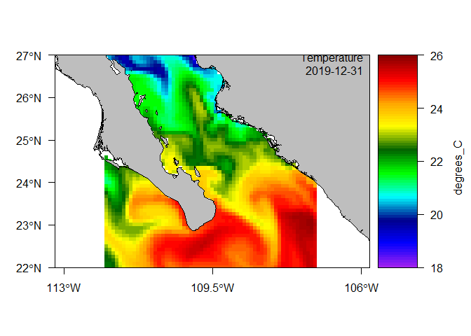
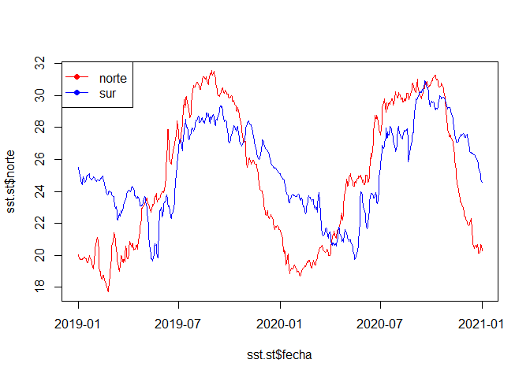
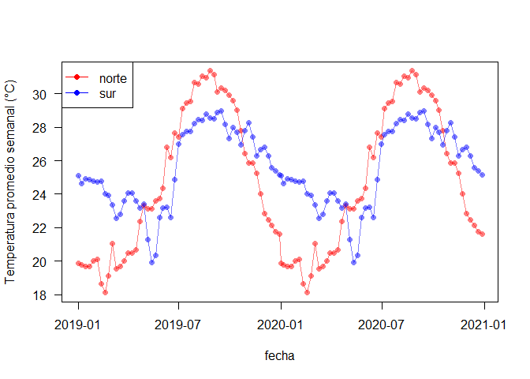

# tarea
melissa_mayorga

## Reporte de curso AECID

### Ejercicio datos temporales

ESCRIBIR DESCRIPCIÓN

SE EMPLEARON DATOS DE COPERNICUS. SE IMPORTARON CON EL PAQUETE **SATIN**

``` r
library(satin) #cargar paquete
sst <- read.cmems("cmems_mod_glo_phy_my_0.083deg_P1D-m_1728505215428.nc")
```

Una vez IMPORTADO SE INSPECCIONÓ

``` r
sst
```

    Object of class satin

     Title: thetao 
     Long name: Temperature 
     Name: thetao 
     Units: degrees_C 
     Temporal range: daily 
     Spatial resolution: 9.2 km 

    Data dimensions:
     61 60 731 2 

    Data ranges:
              lon lat   thetao     period    depth
    min -112.0000  22 13.78762 2019-01-01 0.494025
    max -107.0833  27 32.84582 2020-12-31 1.541375

Se trata de datos diarios de temperatura (temperatura potencial) a dos
profundidades correspondientes a dos años (2019-2020).

hacer un mapa del primer día.

``` r
data(dmap)
plot(sst, map = dmap, period = 365)
```



extraer datos de dos pixeles

``` r
pts <- data.frame(lon = c(-111.1917, -109.5728),
                  lat = c(26.38483, 22.30874))
x <- extractPts(sst, points = pts)

sst.st <- data.frame(fecha = sst@period$tmStart,
                     norte = t(x[1, 7:(731+6)]),
                     sur = t(x[2, 7:(731+6)]))
names(sst.st)[2:3] <- c("norte", "sur")
head(sst.st)
```

            fecha    norte      sur
    p1 2019-01-01 20.05734 25.50014
    p2 2019-01-02 19.97971 25.46644
    p3 2019-01-03 19.85592 25.23719
    p4 2019-01-04 19.76290 24.95959
    p5 2019-01-05 19.77975 24.80358
    p6 2019-01-06 19.74459 24.66442

Graficar series de tiempo

``` r
plot(sst.st$fecha, sst.st$norte, type = "n")
lines(sst.st$fecha, sst.st$norte, col = "red")
lines(sst.st$fecha, sst.st$sur, col = "blue")
```



promedios semanales

``` r
sst.weekly <- satinMean(sst, by = "%Y-%W")
```

``` r
x <- extractPts(sst.weekly, points = pts)

sstW.st <- data.frame(sst.weekly@period$tmStart,
                      t(x[1, 7:(53+6)]),
                      t(x[2, 7:(53+6)]))
```

    Warning in data.frame(sst.weekly@period$tmStart, t(x[1, 7:(53 + 6)]), t(x[2, :
    row names were found from a short variable and have been discarded

``` r
names(sstW.st) <- c("fecha", "norte", "sur")

plot(sstW.st$fecha, sstW.st$norte, type = "n",
     ylab = "Temperatura promedio semanal (°C)",
     xlab = "fecha", las = 1)
lines(sstW.st$fecha, sstW.st$norte, col = rgb(1, 0, 0, 0.5), type = "o", pch = 16)
lines(sstW.st$fecha, sstW.st$sur, col = rgb(0, 0, 1, 0.5), type = "o", pch = 16)
legend("topleft", col = c("red", "blue"), lty = 1, pch = 16, legend = c("norte", "sur"))
```


